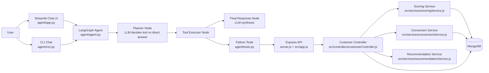

# Banking AI Agent

A hybrid banking intelligence project that combines:
- a Node.js + Express + MongoDB backend for customer profiling and scoring
- a Python LangGraph + LLM agent for natural language decision support

This project is designed for assignment/demo use cases where you need to show both system engineering and practical AI workflow design.

## 1. Architecture Diagram



## 2. Execution Flow

### Backend data and scoring flow
1. API call reaches Express route under `/api/customers`.
2. Controller fetches customers and/or transactions from MongoDB.
3. Services compute:
   - customer score (income + credit + credit transaction behavior)
   - conversion probability (income + credit + net flow)
   - loan recommendation (product + amount + reasons)
4. Controller returns JSON response.

### Agent reasoning flow (LangGraph)
1. User asks a natural language query in Streamlit or CLI.
2. Planner node uses LLM to decide:
   - direct answer, or
   - tool call (`get_loan_targets` / `get_customer_details`).
3. Tool executor runs the selected Python tool which calls backend HTTP API.
4. Final node performs second-pass reasoning to produce user-ready output:
   - concise summary
   - explanation
   - campaign-style messages (if asked)
5. Response and history are stored in state and shown in UI.

## 3. Tool Design and Usage

Python tools are in `agent/tools.py`.

### Tool: `get_loan_targets()`
- Endpoint: `GET /api/customers/loan-targets`
- Purpose: fetch likely-conversion customers with recommendation metadata.
- Returns: list of customer objects with probability, net flow, product recommendation.

### Tool: `get_customer_details(name)`
- Endpoint: `GET /api/customers/customer/:name`
- Purpose: fetch one customer profile by name.
- Returns: customer object or structured error.

### Agent node design
- Planner node: does action selection.
- Tool executor node: isolates side effects and API calls.
- Final node: does answer quality improvement after receiving tool output.

This separation makes the agent easier to debug and extend with new tools.

## 4. Key Design Decisions

1. Hybrid architecture (Node backend + Python agent)
- Why: clean separation between deterministic business logic and LLM orchestration.
- Benefit: backend can be independently tested and reused by non-AI clients.

2. Rule-based financial scoring first, LLM second
- Why: credit/loan logic should be transparent and deterministic.
- Benefit: better explainability for assignment and business review.

3. Two-step LLM flow (plan then compose)
- Why: planner is optimized for tool selection, final node for user communication.
- Benefit: fewer hallucinations and better responses.

4. Seed endpoints for demo data
- Why: makes project evaluation easy during contest/demo.
- Benefit: one-click dataset bootstrapping.

5. Thin Python tool wrappers over REST API
- Why: tool code remains simple and backend ownership stays in Node layer.
- Benefit: low coupling and easy API evolution.

## 5. Trade-offs and Limitations

### Trade-offs
1. Rules over ML model
- Pro: transparent, easy to justify.
- Con: less predictive power than trained models.

2. Multiple runtimes (Node + Python)
- Pro: best tool for each layer.
- Con: more setup complexity and dependency management.

3. LLM planning in plain prompt format
- Pro: quick to build and easy to understand.
- Con: strict parsing can be brittle for malformed model outputs.

### Current limitations
1. No authentication/authorization on API endpoints.
2. No rate limiting or production hardening.
3. No automated test suite yet.
4. Loan targeting thresholds are static and manually tuned.
5. Name-based customer lookup can be ambiguous for duplicate names.
6. Error handling is basic and not fully standardized across all endpoints.

## 6. Setup and Run Instructions

## Prerequisites
- Node.js 18+
- Python 3.10+
- MongoDB running locally or remotely
- OpenAI API key (for LangChain OpenAI model calls)

## Step 1: Install backend dependencies
From project root:

```bash
npm install
```

## Step 2: Configure environment
Create `.env` in project root:

```env
MONGO_URI=mongodb://127.0.0.1:27017/banking_ai
OPENAI_API_KEY=your_openai_api_key
```

Notes:
- `MONGO_URI` is used by Node backend.
- `OPENAI_API_KEY` is used by Python agent process.

## Step 3: Start backend server
From project root:

```bash
npm run dev
```

Expected:
- MongoDB Connected
- Server running on port 5000

## Step 4: Install Python agent dependencies
From `agent` folder:

```bash
pip install streamlit langgraph langchain-openai requests
```

## Step 5A: Run Streamlit chat app (recommended)
From `agent` folder:

```bash
streamlit run app.py
```

Open the local Streamlit URL in browser.

## Step 5B: Run CLI agent (alternative)
From `agent` folder:

```bash
python run.py
```

Type `exit` or `quit` to stop.

## Step 6: Seed demo data
Use browser or curl:

```bash
curl http://localhost:5000/api/customers/seed
curl http://localhost:5000/api/customers/seed-transactions
```

## Step 7: Verify APIs

```bash
curl http://localhost:5000/api/customers/high-value
curl http://localhost:5000/api/customers/loan-targets
curl http://localhost:5000/api/customers/customer/Amit
```

## 7. API Summary

- `GET /` : health text response
- `GET /api/customers/high-value` : customers with score >= 60
- `GET /api/customers/loan-targets` : likely conversion candidates with recommendation
- `GET /api/customers/customer/:name` : customer lookup
- `GET /api/customers/seed` : insert dummy customers
- `GET /api/customers/seed-transactions` : insert dummy transactions
- `POST /api/customers/add-dummy` : insert dummy customers

## 8. Suggested Contest Demo Script

1. Start backend and agent UI.
2. Seed customer and transaction data.
3. Ask agent: "Who are the best loan targets?"
4. Ask follow-up: "Generate personalized outreach messages for top 2 customers."
5. Show API output and explain how deterministic scoring + LLM orchestration work together.

This demonstrates architecture clarity, tool-based reasoning, and practical AI-assisted decision support in one flow.
